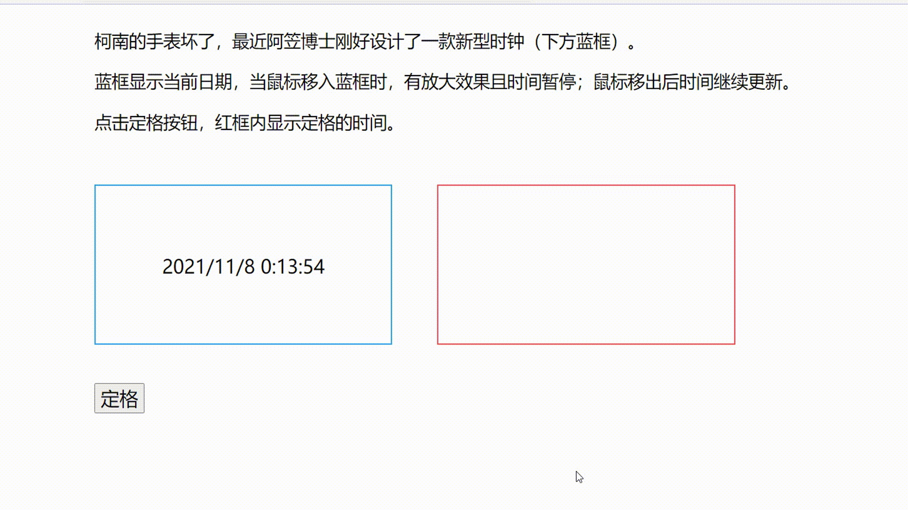
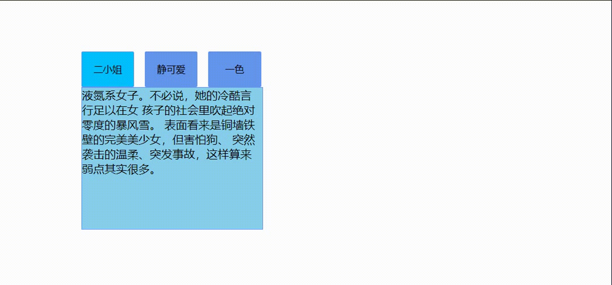
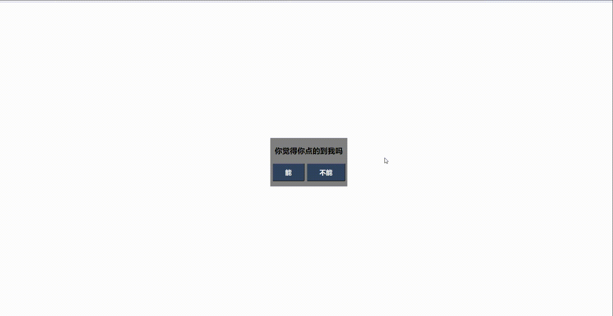

# Frontends 第二轮考核

## 目的

- 使用WebAPI（DOMAPI和BOMAPI）操作网页
- 掌握Javascript的条件，选择，循环语法
- 掌握Javascript的数组，对象，函数

## 任务

1. 柯南的手表

  - 要求看[demo1.html](../img/2-JS与WebAPI.md/demo1.html)
  - 使用Date对象
  - 效果参考


2. 抓出章鱼哥

  - 要求看[demo2.html](../img/2-JS与WebAPI.md/demo2.html)
  - 掌握数组排序(sort)
  - 效果看

3. 蟹老板的秘方

  - 详细要求看[demo3.html](../img/2-JS与WebAPI.md/demo3.html)
  - 掌握循环和判断
  - 效果参考

4. 切换框

  - 页面自己设计，配色不要华丽花哨，让页面干净美观，内容无要求，切换效果实现即可
  - 参考效果看

## Bouns

1. 写一段js代码，获取页面中Dom出现次数最多的前3个名称

    - 尽可能使用ES6特性
    - 不允许使用var，for关键字

2. 实现一个函数get(obj, path, defaultValue)，具有以下功能

    - 参数obj: 任意类型的对象

    - 参数path: 字符串，表示对象的属性路径

    - 参数defaultValue: 任意类型，表示路径不存在时的默认值

    - 返回值: 按照路径取得的属性值，如果路径不存在，返回defaultValue

    - 例如:

        ```javascript
        const obj = {
          a: {
            b: {
              c: 1
            }
          }
        };
        get(obj, 'a.b.c', 2); // 返回 1
        get(obj, 'a.b.d', 2); // 返回 2
        get(obj, 'a.b.d.e.f.g', 2); // 返回 2
        ```

3. 实现一个对象obj，当访问obj中任意一个属性或者或者任意一个属性赋值时，自动在控制台中输出当前访问或者赋值的属性的值和之前的值

    - 例如:

        ```javascript
        obj = {
          a: 1,
          b: 2
        };
        const a = obj.a // 控制台输出 1
        obj.b = 3 // 控制台输出 2,3
        ```

4. 实现一个函数createElement，它可以用来创建虚拟dom，虚拟dom的定义是用js对象来描述一个dom节点，然后实现一个函数mount，它可以通过这个js对象来创建一个真实的dom节点

    - createElement支持常用标签的创建，例如div，ul，li等

    - createElement支持标签的属性设置，例如id，className，style等

    - createElement可以嵌套创建，具体在children属性中描述

    - mount函数可以将createElement创建的虚拟dom挂载到指定的dom节点上，第一个参数是虚拟dom，第二个参数是挂载到dom节点，例如document.body，#app等

    - 例如:

        ```javascript
        const vdom = createElement('div', { id: 'container' }, [
          createElement('ul', { id: 'list' }, [
            createElement('li', { className: 'item' }, ['Item 1']),
            createElement('li', { className: 'item' }, ['Item 2']),
            createElement('li', { className: 'item' }, ['Item 3'])
          ])
        ])
        // vdom的值如下
        vdom = {
          tag: 'div',
          attrs: {
            id: 'container'
          },
          children: [
            {
              tag: 'ul',
              attrs: {
                id: 'list'
              },
              children: [
                {
                  tag: 'li',
                  attrs: {
                    className: 'item'
                  },
                  children: ['Item 1']
                },
                {
                  tag: 'li',
                  attrs: {
                    className: 'item'
                  },
                  children: ['Item 2']
                },
                {
                  tag: 'li',
                  attrs: {
                    className: 'item'
                  },
                  children: ['Item 3']
                }
              ]
            }
          ]
        };
        mount(vdom, document.body);
        // 挂载后，页面中将会有以下内容
        <div id="container">
          <ul id="list">
            <li className="item">Item 1</li>
            <li className="item">Item 2</li>
            <li className="item">Item 3</li>
        </div>
        ```